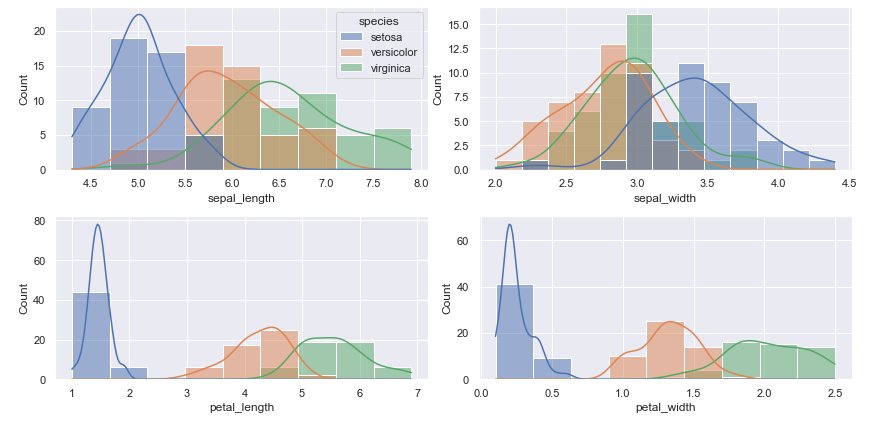
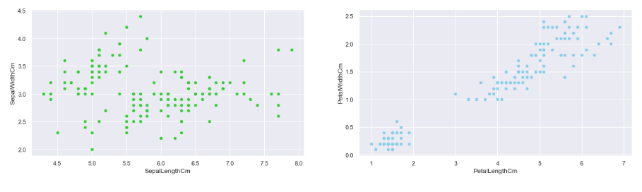
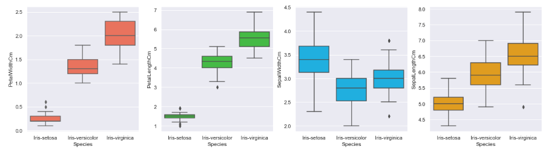

# 📊 Visualizing the Iris Dataset

## 📌 Overview
This project provides a comprehensive visualization of the famous **Iris dataset** using various Python libraries such as **Matplotlib, Seaborn, and Plotly**. The visualizations help in understanding the distribution and relationships among different features of the dataset.

## 🏗️ Features
- 📈 **Histograms** for feature distributions
- 📊 **KDE Plots** for density estimation
- 🟢 **Scatter Plots** for sepal and petal comparisons
- 📦 **Box Plots** to observe variations across species
- 🥧 **Pie Chart** to show species distribution
- 🔵 **Bubble Chart** for categorical representation

## 🛠️ Installation & Usage
### 🔹 Prerequisites
Ensure you have Python installed along with the required libraries:
```bash
pip install pandas numpy matplotlib seaborn plotly scikit-learn
```

### 🔹 Running the Script
Clone the repository and navigate to the project directory:
```bash
git clone https://github.com/1Ayanabil1/iris-visualization.git
cd iris-visualization
```
Run the visualization script:
```bash
python visualization.py
```

## 📂 Dataset
The dataset used is the **Iris dataset**, available as `Iris.csv`. It consists of 150 samples with the following attributes:
- `SepalLengthCm`
- `SepalWidthCm`
- `PetalLengthCm`
- `PetalWidthCm`
- `Species`

## 📷 Sample Visualizations
Here are some of the generated visualizations:
- **Histograms:** 📊 Feature distributions
  <p align="center">
  
</p>

- **Scatter Plots:** 🔍 Relationship between dimensions
    <p align="center">
  
</p>

- **Box Plots:** 📦 Comparative analysis across species
    <p align="center">
  
</p>

## 🤝 Contributing
Contributions are welcome! Feel free to fork the repository and submit a pull request.

## 📜 License
This project is licensed under the **MIT License**.

---
📧 For any inquiries, reach out via [ayanabil297@gmail.com](mailto:ayanabil297@gmail.com). Happy coding! 🚀

